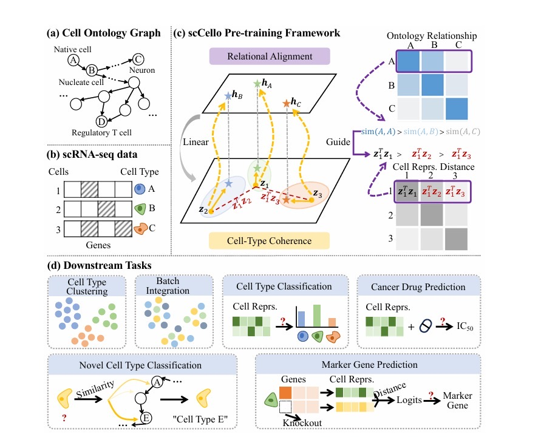

# **Deciphering Cellular Relationships with scCello: A Cell Ontology-Guided Foundation Model**

## **Authors**  
- Md Faihaj Alam Topu (1905032)
- Abdullah Nayem Wasi Emran (1905034)  
- Rakib Abdullah (1905047)

---

## **1. Introduction**

Transcriptome Foundation Models (TFMs), as a new category of deep networks, apply self-supervised learning strategies to make sense out of abundant scRNA-seq datasets. Such models seek to understand the vast “vocabulary” of gene expression to facilitate the knowledge of various cell functions and underlying factors of diseases. Like natural language models, TFMs regard genes as “tokens” and cells as “sentences,” thereby making it possible to identify biologically meaningful phrases. For example, by analyzing the "sentence structure" of gene expression, TFMs can identify key regulatory genes similar to identifying critical words in a paragraph.

However, a key limitation of current TFMs is the absence of **cell ontology integration**. Cell ontology serves as a structured representation of relationships between different cell types, akin to a family tree, where each branch represents a lineage or functional similarity. By incorporating this framework, TFMs can go beyond analyzing cells as isolated entities and instead understand their **context and lineage**, making predictions more biologically meaningful and relevant.

A better understanding of these interactions impacts fields such as disease modeling, targeted therapy, and drug discovery. Incorporating cell ontology into TFMs could enhance their predictive power, enable the discovery of new cell types, and identify disease- or drug-associated genes. This development positions **scCello** as a promising innovation in computational biology.

---

## **2. Overview of scCello**

By scaffolding molecule models with the help of cell ontology graphs during TFM pretraining, scCello provides a novel methodology. This paradigm improves the biological understanding and efficacy of learning cell representations. The main contributions of this work include:

### **Utilization of the Existing Cell Ontology Graphs**
Using cell types that are hierarchically organized in the form of graphs allows scCello to encode the biological relationships that link these representations. This approach embeds cell types in the same latent space, enriching the biological context by capturing lineage relationships and cell interactions.

### **Creation of New Loss Functions**
- **Cell-Type Coherence Loss**: Aligns cells with their subtypes for consistency in the learned representation space.
- **Ontology Alignment Loss**: Captures inter-cellular relationships using **Personalized PageRank**, a graph-based algorithm that measures the proximity of nodes in biological networks.

### **Illustration of the Generalization and Transferability**
scCello excels in tasks such as:
- **Zero-Shot Classification**: Predicting the type of unseen cells.
- **Marker Gene Prediction**: Identifying key genes for specific cell types.
- **Cancer Drug Response Estimation**: Predicting drug sensitivity for new cell types.

scCello generalizes across unseen cell types, tissues, and donors, representing a substantial improvement over existing models.

To summarize, the key features of scCello are presented in Table 1:

| **Feature**                         | **Description**                                                                                      |
|-------------------------------------|------------------------------------------------------------------------------------------------------|
| Utilization of Cell Ontology Graphs | Encodes hierarchical biological relationships, enhancing contextual understanding of cellular lineages and interactions. |
| New Loss Functions                  | - **Cell-Type Coherence Loss**: Aligns cells with their subtypes for consistency.                   |
|                                     | - **Ontology Alignment Loss**: Captures inter-cellular relationships using Personalized PageRank.    |
| Generalization and Transferability  | Excels in tasks like zero-shot classification, marker gene prediction, and cancer drug response across unseen datasets. |

---

## **3. Methodology** 

### **Data Sources**
The scCello model leverages two key data sources:
1. **scRNA-seq Data**: Single-cell RNA sequencing data from 22 million cells, sourced from the **CellxGene database**.
2. **Cell Ontology Graph**: A graph from the **Open Biological and Biomedical Ontology Foundry**, describing hierarchical relationships between cell types (e.g., "stem cell" → "progenitor cell").

These resources allow scCello to integrate both **gene expression data** and **cell lineage relationships** into its training.

### **Pre-Training Objectives**
scCello employs three distinct levels of learning objectives to ensure it captures biologically relevant features:

1. **Gene-Level Objective**:
   - Predicts masked genes using the remaining genes, learning co-expression patterns.
   - For example, if a T cell expresses genes X and Y, scCello predicts gene Z based on co-expression.

2. **Intra-Cellular Objective**:
   - Ensures cells of the same type cluster together in the learned representation space, preserving intra-cellular relationships.

3. **Inter-Cellular Objective**:
   - Aligns cell embeddings based on their positions in the ontology graph. For example, neurons and astrocytes have closer embeddings compared to unrelated cell types.

### **Explanation of the scCello Framework**

**(a) Cell Ontology Graph**:
   - This diagram represents the hierarchical relationships between cell types (e.g., "native cell" → "neuron").
   - Nodes represent cell types, and edges capture lineage relationships.

**(b) scRNA-seq Data**:
   - The input data includes individual cells with their corresponding gene expression profiles and cell type labels (e.g., Cell 1 = "Type A").
   - Gene expression values are used to train the model at the **gene-level objective**.

**(c) scCello Pre-Training Framework**:
   - The framework combines three learning objectives:
     - **Relational Alignment**: Embeddings respect ontology relationships (e.g., similarity between A > similarity between B and C).
     - **Cell-Type Coherence**: Cells of the same type (e.g., A, B, C) have embeddings that cluster together.
     - **Gene Prediction**: Masked genes (e.g., z1, z2, z3) are predicted to understand co-expression patterns.

**(d) Downstream Tasks**:
   - The trained model supports multiple tasks, including:
     - **Cell Type Clustering**: Grouping cells based on learned embeddings.
     - **Batch Integration**: Reducing variability introduced by experimental conditions.
     - **Cell Type Classification**: Predicting cell types from embeddings.
     - **Novel Cell Type Identification**: Detecting new cell types by aligning embeddings with ontology relationships.
     - **Cancer Drug Prediction**: Using cell embeddings to predict drug sensitivity.
     - **Marker Gene Prediction**: Identifying key genes associated with cell types.

---

## **4. Experiments and Results**

### **Datasets and Evaluation Metrics**
scCello was tested on:
- **In-Distribution (ID) Dataset**: Includes cell types seen during pre-training.
- **Out-of-Distribution (OOD) Datasets**: Includes unseen cell types, tissues, or donors.

Metrics include:
- **Clustering Metrics**: Adjusted Rand Index (ARI), Normalized Mutual Information (NMI), and Average Silhouette Width (ASW).
- **Classification Metrics**: Accuracy, Macro F1, and Area Under the ROC Curve (AUROC).
- **Regression Metrics**: Pearson Correlation Coefficient (PCC) for drug response prediction.

### **Key Results**
1. **Zero-Shot and Fine-Tuning Performance**:
   - scCello achieved **state-of-the-art results** for cell type identification, even for unseen cell types.

   | **Metric** | **scCello** | **Geneformer** | **scGPT** |
   |------------|-------------|----------------|-----------|
   | NMI (ID)   | **0.785**   | 0.616          | 0.615     |
   | ARI (OOD)  | **0.558**   | 0.261          | 0.258     |

2. **Robustness to Batch Effects**:
   - scCello effectively integrated datasets from different labs, reducing variability caused by experimental differences.

3. **Novel Cell Type Classification**:
   - scCello successfully identified new cell types by leveraging its understanding of ontology relationships.

### **Visualization of Results**
Here’s a table summarizing scCello’s clustering performance compared to baseline models:

| **Method**     | **In-Distribution (ID)** | **Out-of-Distribution (OOD)** | **AvgBio (ID)** | **AvgBio (OOD)** |
|----------------|--------------------------|-------------------------------|-----------------|------------------|
| Raw Data       | 0.566                   | 0.570                         | 0.419           | 0.458            |
| Seurat         | 0.648                   | 0.611                         | 0.442           | 0.466            |
| Harmony        | 0.621                   | 0.459                         | 0.421           | 0.456            |
| scVI           | 0.660                   | 0.613                         | 0.474           | 0.478            |
| Geneformer     | 0.616                   | 0.574                         | 0.432           | 0.468            |
| scGPT          | 0.615                   | 0.589                         | 0.438           | 0.456            |
| scTab          | 0.707                   | /                             | 0.577           | /                |
| UCE            | 0.670                   | 0.629                         | 0.489           | 0.485            |
| MGP            | 0.662                   | 0.611                         | 0.473           | 0.488            |
| Sup            | 0.703                   | 0.659                         | 0.555           | 0.552            |
| MGP+Sup        | 0.661                   | 0.655                         | 0.516           | 0.553            |
| **scCello**    | **0.785**               | **0.687**                     | **0.670**       | **0.608**        |

---

## **5. Insights and Applications**

Integrating **cell ontology** into **Transcriptome Foundation Models (TFMs)** is more than just a technical innovation—it’s a leap forward in making biological insights more accurate and actionable. In this section, we’ll dive into how scCello’s unique approach enhances biological relevance and transferability, opening doors to transformative applications in healthcare and research.

### **Applications That Matter**

#### **1. Precision Medicine: Tailoring Healthcare to Individuals**
Precision medicine thrives on understanding how variations in gene expression translate into cellular functions and disease mechanisms. With scCello:
- **Improved Diagnostics**: The model can more accurately classify cell types, aiding in the early detection of conditions like cancer or autoimmune disorders.
- **Personalized Treatments**: It enables predictions of how a patient’s cells might respond to specific drugs, paving the way for individualized treatment plans.

#### **2. Drug Discovery: Accelerating Innovation**
Developing new drugs is a lengthy and expensive process. scCello addresses this challenge by:
- **Predicting Drug Responses**: By analyzing cell types and gene expressions, the model predicts how cells respond to treatments, saving time and resources in identifying promising drug candidates.
- **Unveiling Novel Targets**: Its advanced analysis can reveal previously unknown cell markers or pathways crucial for therapeutic interventions.

#### **3. Disease Modeling: Decoding Complex Disorders**
Diseases like cancer, diabetes, and neurodegenerative conditions often involve complex interactions at the cellular level. scCello’s ability to model these interactions makes it a powerful tool for:
- **Understanding Disease Progression**: The model helps simulate how diseases evolve by analyzing changes in cell states over time.
- **Developing Therapies**: Insights gained from these simulations can guide the creation of more effective treatments.

---

## **6. Limitations and Future Directions**
### **Limitations**:
1. **Scalability**: Processing larger ontology graphs demands higher computational power.
2. **Interpretability**: Linking embeddings to specific biological mechanisms remains a challenge.

### **Future Work**:
- Optimizing scalability for broader datasets.
- Enhancing interpretability through visualization tools.

---

## **7. Conclusion**
### **A Transformative Step Forward**

scCello isn’t just a technical advancement—it’s a reimagining of how we decode the intricate language of cells. By bridging biology and machine learning, it enables:

- **Accurate cell type identification**.
- **Improved drug response predictions**.
- **Generalization across unseen datasets**.

With scCello, the future of personalized medicine, drug discovery, and disease modeling is within reach.

---

## **References**
- Paper: [Cell-Ontology Guided Transcriptome Foundation Model](https://arxiv.org/abs/2408.12373)
- GitHub Repository: [scCello Source Code](https://github.com/DeepGraphLearning/scCello)

---
